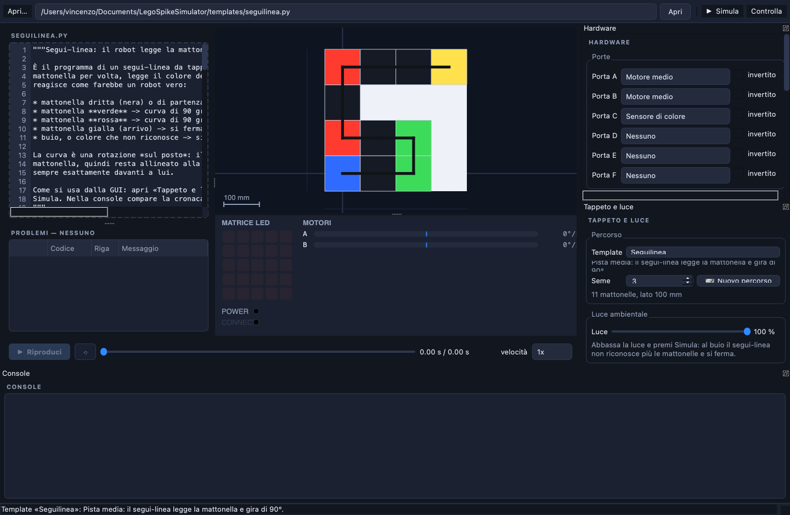
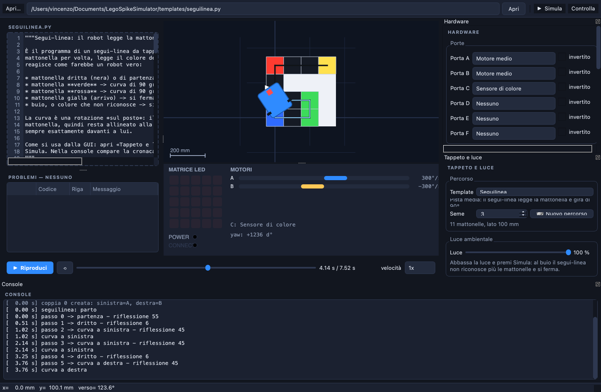
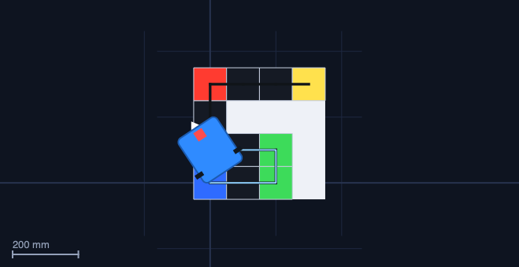
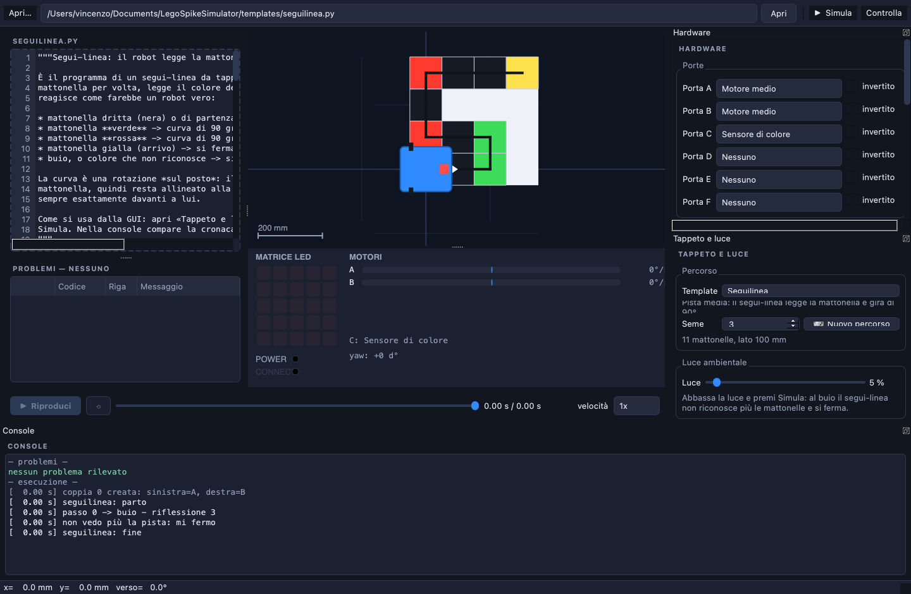
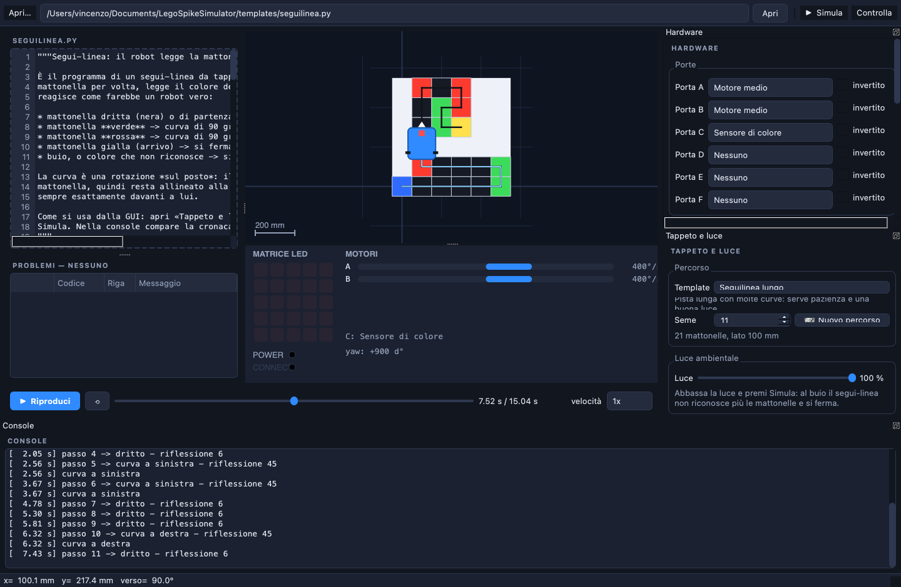

# LEGO SPIKE Prime Simulator

*[Leggi questo documento in italiano →](README.it.md)*

A desktop simulator for Python programs written for the **LEGO Education SPIKE
Prime** hub. You load a `.py` file, press **Simula**, and watch the robot drive
around a 2D field while the program runs: where it goes, how far it turns, what
it shows on the LED matrix — and above all **what is wrong with it**.

The robot can drive on a **mat made of tiles**. The colour sensor reads the tile
the robot is standing on, so a *line follower* program reacts exactly like a
real robot: it sees a green tile, and it turns 90° left. Tiles are laid out at
random, and you can dim the lights to watch the robot lose the track.



**Your program is never modified.** The SPIKE 3 library is re-implemented and
exposed under its original names (`import motor`, `from hub import port`, …),
and MicroPython's `time` module gets `sleep_ms`, `ticks_ms` and friends.

The library follows the
[SPIKEPythonDocs — SPIKE 3](https://tuftsceeo.github.io/SPIKEPythonDocs/SPIKE3.html)
documentation. The extracted text of that page, used as the implementation
reference, is in [`docs/spike3-reference.txt`](docs/spike3-reference.txt).

---

## Installation

You need **Python 3.10 or newer**. Qt is the only dependency.

```bash
# 1. get the code
git clone https://github.com/vincenzosco/LegoSpikeSimulator.git
cd LegoSpikeSimulator

# 2. (recommended) create a virtual environment
python3 -m venv .venv
source .venv/bin/activate          # Windows: .venv\Scripts\activate

# 3. install the dependency
python3 -m pip install -r requirements.txt

# 4. run it
python3 run_simulator.py
```

That is all: no build step, no Qt installation, no hardware.

### Verify the installation

```bash
python3 -m pytest -q     # the whole test suite, about 6 seconds
```

If you see `232 passed`, everything is in place.

## Quick start

```bash
python3 run_simulator.py                        # the window opens on a ready track
python3 run_simulator.py examples/quadrato.py   # or straight into one of the examples
python3 -m spikesim                             # equivalent to run_simulator.py
```

The simulator opens with the **Seguilinea facile** template already loaded:
press **Simula (F5)** and the robot will drive the track.

## Step by step

### 1. Choose a template

The dock on the right, **«Tappeto e luce»**, lists the ready-made tracks:

| Template | What it is |
|---|---|
| **Seguilinea facile** | a short track with two corners — the first one to try |
| **Seguilinea** | a medium track: the follower reads each tile and turns 90° |
| **Seguilinea lungo** | a long track with many corners |

Picking one generates a **new random track** and loads the program that drives
it. Do not like this track? Press **🎲 Nuovo percorso**. The **Seme** (seed)
field is what makes the draw reproducible: the same seed always gives the same
track, so a run you liked can be replayed exactly.

### 2. Understand the tiles

The mat is a grid of tiles. The colour sensor measures the tile **under the
centre of the robot**, which is what makes the program able to react:

| Tile | Colour the sensor reads | What the line follower does |
|---|---|---|
| Start | blue | go straight |
| Straight | black | go straight |
| Left corner | **green** | turns 90° left |
| Right corner | **red** | turns 90° right |
| Finish | yellow | stops |

The tiles are laid out at random into a connected track, always starting at the
blue tile and ending on the yellow one. Each corner is a rotation **in place**,
so the robot stays centred on the tile and the next tile is always straight
ahead.



The console on the bottom tells you what the robot sees at every step:

```
seguilinea: parto
passo 0 -> partenza - riflessione 55
passo 1 -> dritto - riflessione 6
passo 2 -> curva a sinistra - riflessione 45
curva a sinistra
passo 3 -> dritto - riflessione 6
...
arrivato!
```



### 3. Turn the lights down

The **Luce** slider sets the ambient light from 100 % down to 0 %. Reflection is
proportional to the light: at half the light the reading is halved. Below
**25 %** the colour sensor can no longer tell the colours apart and reports
*unknown* — exactly what happens to a real sensor in the dark.



At 5 % the very same program stops immediately with
`non vedo più la pista: mi fermo`. Put the slider back to 100 %, press
**Simula** again, and it completes the track. That is the whole point: the
light changes the robot's behaviour.

### 4. Take a longer track



### 5. Load your own program

1. **Load the program** in one of two ways:
   * drag the `.py` file onto the window (the code panel highlights when the
     file is acceptable), or
   * paste the path into the field at the top and press *Apri* or Enter.
2. Look at the **Problemi** panel: it is updated immediately, without running
   anything. Double-clicking a problem jumps to the offending line.
3. Press **Simula** (or `F5`). The program runs in a separate process; when it
   finishes, playback starts by itself.
4. Use the **timeline** to review the motion: pause, rewind to an exact instant,
   speed from 0.25× to 10×. The trigger moves, the robot drives and the console
   fills up as time advances.
5. Closing the window during a simulation kills the child process immediately:
   nothing is left running in the background.
6. In the **Hardware** dock you declare what is plugged into each port. That is
   what lets the simulator say "there is nothing on this port" and know which
   wheels actually move the robot.

A program that drives the robot itself can also be written from scratch:

```python
import motor_pair, runloop
from hub import motion_sensor, port

async def main():
    motor_pair.pair(motor_pair.PAIR_1, port.A, port.B)
    await motor_pair.move_for_degrees(motor_pair.PAIR_1, 720, 0, velocity=500)

runloop.run(main())
```

## What it reports

Static checking runs *before* execution, runtime diagnostics while the program
runs. Every message carries a code and, when it exists, a line number.

### Mistakes in the program itself

| Code | Meaning |
|---|---|
| `SYN001` | syntax error, with line and column |
| `SYN002` | the file cannot be read |
| `PYTHON` | a Python exception while running (program line + full traceback) |
| `SPIKE100` | misspelled module (`import motr` → "did you mean motor?") |
| `SPIKE101` | unknown name in a SPIKE module (`motor.runn`, `color.PINK`, `port.G`) |
| `SPIKE102` | async function called without `await`: it does absolutely nothing |
| `SPIKE103` | `runloop.run(main)` without parentheses |
| `SPIKE104` | an `async def` defined and never started |
| `SPIKE105` | motor pair used before `motor_pair.pair(...)` |
| `SPIKE106` | motor or sensor used on a port where there is none |

### Errors and warnings during the simulation

| Code | Meaning |
|---|---|
| `SPIKE010` | invalid port (ports are `port.A` … `port.F`) |
| `SPIKE011` | the requested sensor is not on that port |
| `SPIKE012` | there is no motor on that port |
| `SPIKE013` | a motor pair was never created with `motor_pair.pair` |
| `SPIKE014` | invalid argument (for instance velocity 0 in a timed move) |
| `SPIKE015` | pixel outside the device grid |
| `SPIKE016` | the program does not terminate: stopped at the time or step limit |
| `SPIKE018` | trace truncated: the program is too long |
| `SPIKE019` | the motor is not moving and will not reach the requested position |
| `SPIKE020` | a command was created and never awaited |
| `SPIKE021` | every task is blocked on something unschedulable |
| `SPIKE022` | `await` on something that is not a SPIKE operation (e.g. `asyncio`) |
| `SPIKE023` | `runloop.run(main)` without parentheses: the function is started anyway |
| `SPIKE024` | `runloop.run` received no `async` function |
| `SPIKE031`–`SPIKE034` | brightness, volume, velocity or steering out of range: clamped |
| `TIMEOUT` | the process did not answer and was interrupted |
| `CANCELLED` | the simulation was cancelled (window closed) |
| `RUNNER` | the process running the program produced no valid trace |

## The simulation model

### Time

Time is **virtual**: `sleep_ms(1000)` costs a few milliseconds of real time, not
a second. The eight programs in `examples/`, infinite loop included, are
simulated in about half a second. Time only advances when every task is waiting,
so the result is also reproducible.

### Motion

The robot is a two-wheel differential drive base:

* only the motors on the ports declared as *left wheel* and *right wheel* move
  the robot; a motor on another port spins but moves nothing (it is an arm);
* motor rotation becomes wheel travel through the wheel diameter
  (`motor_degrees_to_mm`), and the two wheels become the robot's advance and
  turn (`integrate`);
* integration uses the exact constant-curvature solution, so an arc covered in
  one step or in a hundred steps gives the same result;
* the gyroscope (`motion_sensor.tilt_angles()`, `reset_yaw`,
  `angular_velocity`) follows the robot's heading: a program that turns 90° by
  reading the yaw really works (see `examples/quadrato.py`).

Steering follows the Word-blocks convention: `0` straight, `100` right,
`-100` left. For a pair, `degrees` is the rotation of the faster wheel.

### The mat

* The mat is a grid of tiles (100 mm by default) generated **once**, in the GUI,
  and then carried inside the configuration down to the process running the
  program — so the robot always drives over the mat you are looking at.
* The colour sensor samples the tile under the robot's **centre**. Turning in
  place therefore does not change the reading, which is what keeps the follower
  aligned to the grid.
* Reflection is proportional to the ambient light, and below 25 % the colours
  become indistinguishable (`color.UNKNOWN`).

### Known limitations

The simulator targets the *behaviour* of a program, not fine mechanics. Not
modelled:

* acceleration and deceleration ramps: velocity is constant for the whole
  command (`acceleration`/`deceleration` are accepted and ignored);
* friction, inertia, wheel slip and collisions: the robot never skids and never
  meets an obstacle;
* the hub buttons are never pressed and gestures never happen: a loop waiting
  for a button never ends and is stopped by the step limit, with a message that
  says so;
* sensors other than the colour sensor return the values set in the Hardware
  panel: there is no environment to measure (the colour sensor is the one that
  reads the mat);
* `app.display`, `app.bargraph`, `app.linegraph`, `app.music` and `app.sound`
  write to the console instead of drawing on a tablet;
* the 67 LED-matrix images are the 5×5 bitmaps from the MicroPython micro:bit
  project (MIT licence), which LEGO reuses. The four `IMAGE_GO_*` have no
  micro:bit equivalent and are mapped onto the matching `IMAGE_ARROW_*`;
* the field is the mathematical plane: `+x` east, `+y` north, and the robot
  starts at the mat's start pose facing east.

### A note on the `spike3_stubs` package

Some environments ship a `spike3_stubs` package in `site-packages` providing
modules named `hub`, `motor`, `runloop`, … that merely abort saying they only
work on real hardware. The simulator registers its own modules in `sys.modules`
before running the program, so the simulated library always wins: the user's
program does not need to know which of the two is installed.

## Project layout

```
run_simulator.py            the GUI entry point
templates/                  ready-to-run SPIKE programs (seguilinea.py, ...)
examples/                   example programs, including deliberately broken ones
tools/make_screenshots.py   regenerates the images in this README, headlessly
spikesim/
  kinematics.py             pure physics model (no Qt dependency)
  mat.py                    the tile mat: surfaces, lighting, random tracks
  templates.py              the template catalogue (track + program + ports)
  config.py                 what is plugged into each port, robot geometry
  errors.py                 SPIKE library exceptions, with stable codes
  trace.py                  simulation trace: events, poses, diagnostics
  runtime.py                virtual clock, simulated hardware, scheduler
  spike/                    the executable SPIKE 3 library
    motor.py  motor_pair.py  runloop.py  device.py  color.py  orientation.py
    color_sensor.py  distance_sensor.py  force_sensor.py  color_matrix.py
    hub/                    port, button, light, light_matrix, motion_sensor, sound
    app/                    bargraph, display, linegraph, music, sound
  spike_api.py              module registration and the `time` shim
  runner.py                 program execution (in-process or separate)
  checker.py                static analysis, before running
  gui/                      PyQt5 window, 2D field, LED matrix, console
docs/spike3-reference.txt   the SPIKE 3 library reference
docs/screenshots/           the images used by the READMEs
docs/plans/                 the implementation plans
```

Everything outside `spikesim.gui` avoids importing Qt: it can be tested and used
from the command line.

## Tests

```bash
python3 -m pytest -q
```

The GUI tests run without a screen (`QT_QPA_PLATFORM=offscreen` is set by
`tests/conftest.py`): the window is really built, the program is really executed
in a separate process, and the robot view is really painted and compared between
the start and the end of the simulation.

## Command line

```bash
python3 -m spikesim.runner --file examples/quadrato.py            # JSON trace on stdout
python3 -m spikesim.runner --file examples/quadrato.py --out t.json
```

The child process writes **only** the JSON trace on `stdout`; everything else
goes to `stderr`.

## Regenerating the screenshots

```bash
python3 tools/make_screenshots.py
```

It builds the real window offscreen, runs the templates and rewrites
`docs/screenshots/*.png`, verifying that each image really shows what its
caption claims.

## Licence

MIT — see [LICENSE](LICENSE). The LED-matrix bitmaps come from the MicroPython
micro:bit project (MIT).
